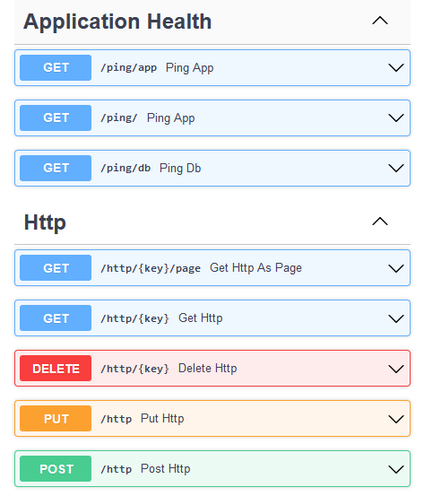

<h1>Trying FastAPI</h1>

This is a small template project for my future FastAPI applications (if there's any).

- [Description](#description)
  - [Tools used:](#tools-used)
- [Building](#building)
  - [Software requirements](#software-requirements)
  - [First run](#first-run)

## Description
The application provides an API to deploy static HTML pages. It only has one entity - `Html` (a single HTML page), and it implements a standard st of operations over it: `PUT`, `POST`, `GET`, `DELETE`. 

The published HTML page becomes available by link `/http/{key}/page`.

### Tools used:
- Python 3.10 + FastAPI + uvicorn
- PostgreSQL 14 + psycopg2 + asyncpg
- SQLAlchemy + alembic
- pytest
- Poetry (Python dependency manager)
- Docker + docker-compose 
- GNU make 
- GitHub Actions (for CI)

The application can be distributed as a docker image.

## Building

### Software requirements
- [**python3.10**](https://www.python.org/downloads/)

- [**make**](https://en.wikipedia.org/wiki/Make_(software)) tool — for build-automation. To install it on Windows, one can try [GNU make 4.3](https://community.chocolatey.org/packages/make)  package from the [Chocolatey](https://github.com/chocolatey/choco) package manager

- [**Poetry**](https://python-poetry.org/) — to administer Python dependencies

- [**Docker Desktop**](https://www.docker.com/products/docker-desktop/) (or just `docker` and `docker-compose` utils)

### First run
1. Docker Desktop should be up
2. Do `cp .example.env .env` to make a file with environment variables. Look through it and change it as you find suitable (it should also work without any changes if there's no conflict on ports).
3. In the project's root directory run
`poetry install`
to install all the Python packages required.

4. Run `make docker-build` to build the application image.

1. Run `make test` and make sure all the tests passed.

6. Finally, launch the application. You have two options:
    - `make run` if you want it to work from your local machine
    - `make docker-up` if you prefer it running in docker container

7. To check if everything works, you may open `http://{your-app-adress}/docs`, and you should be able to see something similar to the picture on the top of this page.